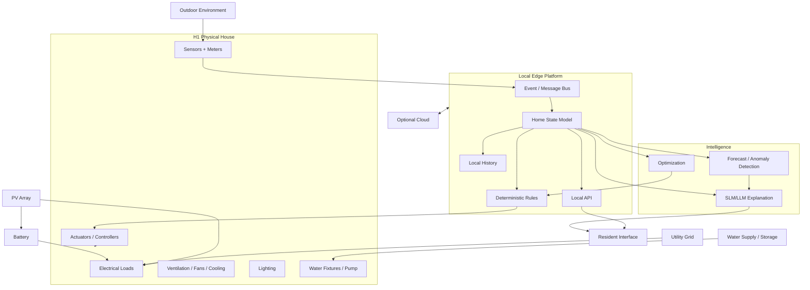
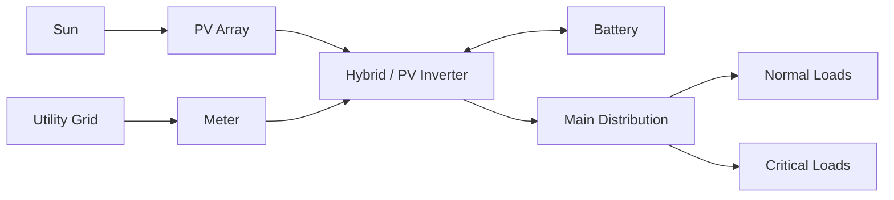
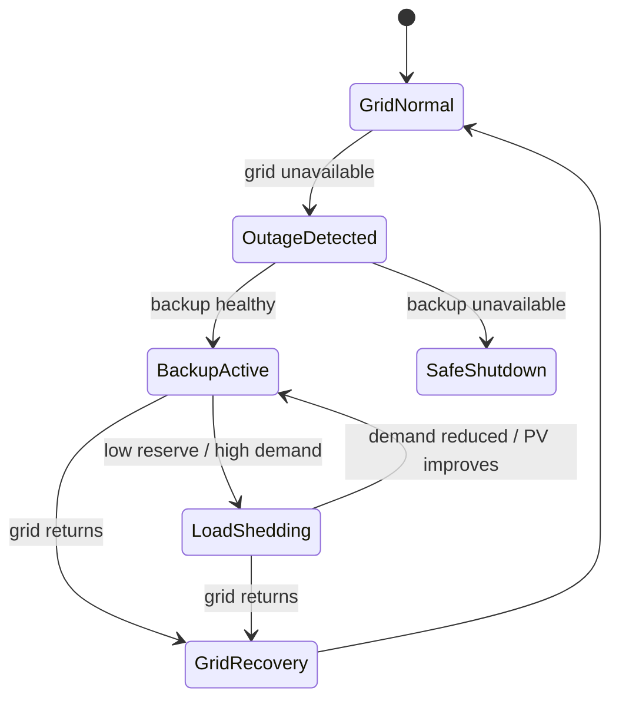
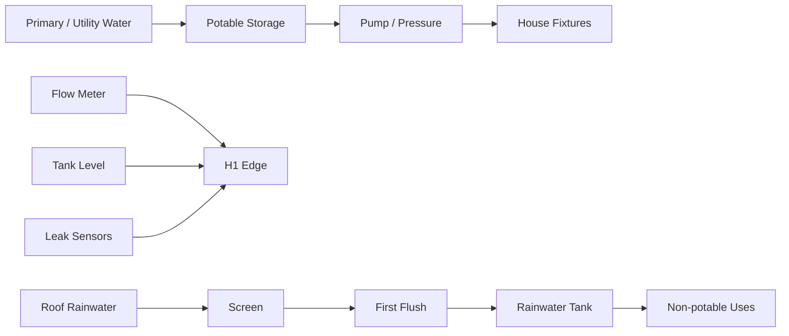
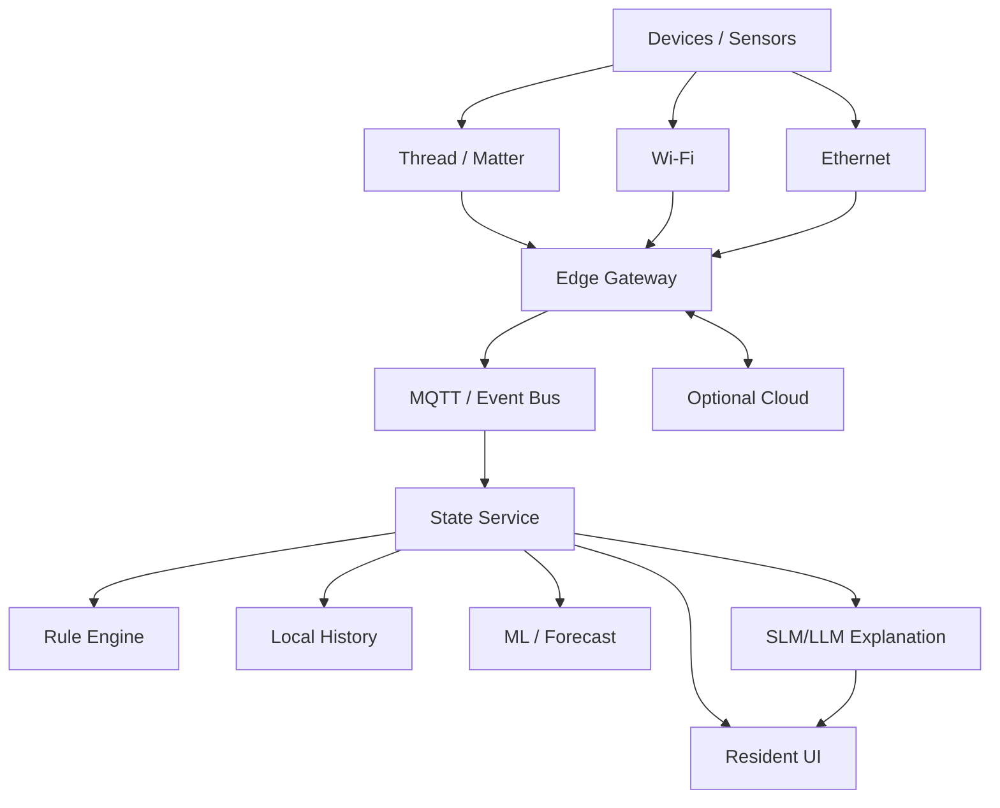
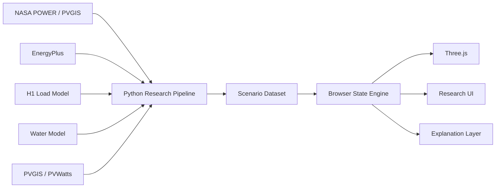

# HORIZON H1 — COMPLETE HANDOFF

Combined reference document for AI-agent ingestion. Individual files remain the preferred editable source.


---

<!-- SOURCE: README.md -->

# HORIZON H1 — Intelligent Home Research Prototype

**Status:** concept + research + implementation specification  
**Version:** 0.1  
**Reference context:** Accra, Ghana as the initial climate/regulatory reference; exact site TBD  
**Parent brand:** Horizon  
**Public project name:** **Horizon H1 — Intelligent Home Study**

## What H1 is

Horizon H1 is a research-backed interactive prototype exploring how a future residential environment could integrate:

- architecture and passive climate design;
- solar PV, battery storage and grid electricity;
- outage resilience and critical-load management;
- water supply, storage, rainwater research and leak monitoring;
- indoor climate, ventilation and air-quality sensing;
- IoT, edge computing and local-first automation;
- machine learning and an optional SLM/LLM explanation layer;
- a resident interface;
- an interactive Blender + Three.js visualization.

The existing Blender model is the **visual shell**. The actual project is the **technical architecture, simulation, research traceability and interaction model behind the shell**.

The visitor should be able to ask:

- Where is the house getting power from right now?
- What happens if the grid fails?
- What is the battery doing?
- What changes when it rains?
- Where is water stored?
- What sensors are active?
- What does the edge computer do?
- Which decisions use deterministic controls, ML, or an SLM/LLM?
- Why was a specific material or subsystem chosen?

Every significant answer should trace to a documented source, assumption, simulation, design decision, or explicitly unresolved research question.

## What H1 is not

H1 is not a construction package, engineered electrical design, plumbing specification, code-compliance certificate, completed Horizon house, or full operational digital twin.

Future physical construction must be reviewed by qualified local professionals against the applicable Ghana Building Code, Energy Commission rules, utility requirements, fire/life-safety requirements and site-specific engineering.

## Core rule

> **The 3D model visualizes the research. The research must not be invented to justify the 3D model.**

## Recommended location inside the current Horizon website

Keep H1 inside the existing site for now, but isolate it so it can later become a standalone repository:

```text
horizon-website/
├── app/
│   └── research/
│       └── h1/
│           └── page.tsx
├── src/
│   └── features/
│       └── horizon-h1/
│           ├── components/
│           ├── scene/
│           ├── simulation/
│           ├── state/
│           ├── data/
│           ├── ai/
│           ├── content/
│           ├── utils/
│           └── tests/
├── public/
│   └── h1/
│       ├── models/
│       ├── textures/
│       ├── data/
│       ├── images/
│       └── video/
└── horizon-h1/
    ├── docs/
    ├── diagrams/
    ├── schemas/
    ├── research/
    └── README.md
```

The runtime code belongs in `src/features/horizon-h1/`. The long-form research and architecture documentation belongs in `horizon-h1/`. That boundary makes later extraction into a dedicated GitHub repository straightforward.

## Read order

1. `docs/01_PROJECT_CHARTER.md`
2. `docs/02_BUILDING_AND_MATERIALS.md`
3. `docs/03_SYSTEM_ARCHITECTURE.md`
4. `docs/04_ENERGY_WATER_CLIMATE.md`
5. `docs/05_EDGE_AI_SECURITY.md`
6. `docs/06_INTERACTIVE_3D_BLENDER_UX.md`
7. `docs/07_SIMULATION_RESEARCH_AND_VALIDATION.md`
8. `implementation/WEBSITE_REPO_INTEGRATION.md`
9. `research/REFERENCES.md`
10. `implementation/ASTRA_MASTER_PROMPT.md`

## Public positioning

Use labels such as:

- Research
- Concept
- Reference architecture
- Simulation
- Prototype in development
- Interactive demonstrator
- Conceptual digital-twin prototype

Avoid language implying a completed physical development until that is actually true.

## One-line public description

**Horizon H1 is a research-backed interactive study of how energy, water, climate, sensing, edge computing and AI could work together as one intelligent residential system.**


---

<!-- SOURCE: docs/01_PROJECT_CHARTER.md -->

# 01 — Project Charter

## Purpose

H1 exists to transform the Horizon vision from a beautiful visual concept into a serious technical learning project.

The intended method is:

**research → assumptions → architecture → simulation → interaction → documentation → iteration**

H1 should become a credible artifact for future applications, researchers, architects, engineers, smart-city programmes, technical collaborators, developers and eventually investors.

## Core research question

> **How can a residential building designed for an African context integrate passive design, distributed energy, water, sensing, edge computing and AI into one coherent system that improves resilience, comfort, efficiency and human experience?**

## Research questions

### Architecture
- How should the building form respond to a warm/humid climate?
- What orientation, shading and glazing decisions reduce cooling demand?
- Which spaces should support natural ventilation?
- Which materials are locally practical, durable and resource-efficient?

### Energy
- What is the actual household load profile?
- What PV size is justified by load, roof area and solar resource?
- What battery capacity produces meaningful resilience?
- Which loads remain powered during outages?
- When should the house import, store or export electricity?
- How does Ghana's net-metering framework affect a future implementation?

### Water
- What are the expected water uses?
- How should primary supply and storage be represented?
- What non-potable role could rainwater play?
- How should flow, tank level and leaks be monitored?

### Comfort and indoor air
- When should shading, natural ventilation, fans, dehumidification or mechanical cooling be used?
- Which indoor variables should be measured?
- How should comfort be represented without reducing it to one fixed temperature?

### IoT and edge
- Which systems require local operation?
- What happens if the internet fails?
- Which devices use Ethernet, Wi-Fi, Thread/Matter or other links?
- How are device identity, update security and access controlled?

### AI
- What should remain deterministic?
- What should use optimization?
- What should use ML?
- What is the legitimate role of an SLM/LLM?
- What should generative AI never directly control?

### Human experience
- What should be automated silently?
- What should be visible?
- How does the resident override automation?
- How does the system explain why something happened?

## H1 success criteria

H1 V1 should let a visitor:

1. understand the house architecture;
2. inspect the PV/grid/battery relationship;
3. trigger a grid-outage scenario;
4. trigger day, night and rain scenarios;
5. inspect at least one indoor climate zone;
6. understand the water path and a leak scenario;
7. inspect the local edge/AI architecture;
8. open a research drawer containing rationale and sources;
9. distinguish simulation/demo values from real measurements;
10. use a responsive fallback if full 3D is unavailable.

## Design principles

### Human first
A technically advanced house that irritates residents has failed.

### Passive before active
Reduce the physical load before adding active control:

```text
shading
  ↓
envelope
  ↓
natural ventilation
  ↓
fans / efficient air movement
  ↓
mechanical cooling
  ↓
optimization
```

### Local before cloud
Critical operations should degrade gracefully without internet access.

### Deterministic before generative
Safety- and infrastructure-critical actions should be bounded, explicit and testable. Generative AI is initially an explanation/interface layer.

### Observable
The house should be able to explain:
- current state;
- recent events;
- alerts;
- major automated actions.

### Modular
Avoid permanent dependence on a single device vendor.

### Research-backed
Tag technical claims as:

- `SOURCE`
- `ASSUMPTION`
- `SIMULATION`
- `DESIGN DECISION`
- `EXPERIMENT`
- `OPEN QUESTION`

## Evidence levels

- **E0 — Idea:** unverified concept.
- **E1 — Sourced concept:** supported by a credible source.
- **E2 — Modeled:** tested by calculation/simulation.
- **E3 — Prototype tested:** validated with physical hardware.
- **E4 — Real deployment:** observed in an actual building.

H1 initially lives mainly at E1–E2.

## Reference context

Use Accra, Ghana as the initial climate/regulatory reference. The current Blender model does **not** represent a real Horizon site.

Before numerical analysis:
- choose a documented reference coordinate;
- record source and dataset version;
- retrieve hourly weather/solar data;
- rerun all major analyses for a real project location later.

## Research toolchain

Suggested:
- Blender — geometry/visualization;
- Three.js or React Three Fiber — web interaction;
- EnergyPlus — building thermal/energy simulation;
- OpenStudio/Honeybee optionally — modeling workflow;
- NASA POWER / PVGIS — weather and solar;
- PVGIS / NREL PVWatts or SAM — PV estimation/cross-check;
- Python, pandas, NumPy — research pipeline;
- Mermaid/SVG — diagrams.

## Long-term scale path

```text
H1 intelligent home
      ↓
Horizon Living
      ↓
multi-home shared systems
      ↓
Horizon Communities
      ↓
district systems
      ↓
Horizon Cities
```


---

<!-- SOURCE: docs/02_BUILDING_AND_MATERIALS.md -->

# 02 — Building and Materials Technical Dossier

## Status

This is a **research specification, not a construction specification**.

The current model does not yet contain enough information about site, soil, structure, cost, fire/life safety, local suppliers or final programme to justify fixed materials.

Therefore H1 should use:
- a provisional simulation baseline;
- a material decision matrix;
- explicit alternatives;
- a record of why each choice is provisional.

The 2018 Ghana Building Code contains dedicated parts on interior environment, energy efficiency/sustainability, roofs, structural loads, concrete, masonry, steel, wood/bamboo/rattan, glazing, electrical systems, mechanical systems, plumbing, small buildings and green-building requirements. H1 should use the Ghana code as its local starting point instead of importing an entire foreign house specification.

## Architectural intent

Evolve the current Blender house toward a warm-climate contemporary home that communicates:

- shade;
- airflow;
- controlled daylight;
- restrained glazing;
- a durable envelope;
- integrated solar;
- water management;
- serviceability;
- landscape;
- discreet technical infrastructure.

Do not design a sealed glass box and attempt to fix the heat load with AI.

## Massing/orientation research direction

Provisional strategy:
- orient the long building axis roughly east-west where site constraints allow;
- reduce uncontrolled east/west glazing;
- shade openings externally;
- use roof overhangs, fins, deep reveals and covered transitions;
- enable cross-ventilation where outdoor air quality, rain, noise and security allow;
- place high-heat equipment away from key occupied zones;
- provide maintainable service spaces.

Every final orientation choice should be simulated.

## Provisional material baseline

### Primary structure
Use a **reinforced-concrete frame/slab baseline** for current simulation and visualization because it is compatible with the present model and common regional construction practice.

But explicitly record:
- this is not automatically the lowest-carbon option;
- concrete quantity, cement content and structural alternatives should later be compared;
- a structural engineer must design the final system.

### External wall
Start with a locally practical masonry/block assembly as a simulation baseline.

Compare later:
- conventional concrete block;
- aerated/autoclaved block if locally available;
- insulated masonry;
- stabilized-earth/laterite systems only if engineering, moisture behavior and supply quality are validated.

Decision dimensions:
- assembly U-value;
- density;
- embodied energy/carbon;
- local availability;
- labor familiarity;
- moisture behavior;
- durability;
- maintenance;
- acoustic performance;
- cost;
- fire performance.

### Roof
The current flat-roof language can use a conceptual build-up:

```text
PV array on engineered mounting
        ↓
ventilated clearance
        ↓
high-reflectance durable roof finish
        ↓
continuous insulation
        ↓
waterproofing / drainage strategy
        ↓
structural roof
        ↓
interior finish
```

The final roof assembly and waterproofing sequence must be professionally engineered.

Research objectives:
- reduce roof solar heat gain;
- maintain drainage during intense rain;
- coordinate PV mounts and membrane;
- avoid ponding;
- allow inspection and maintenance.

DOE cool-roof guidance supports studying high solar reflectance and thermal emittance in hot climates.

### Glazing
Research direction:
- use less glass where glass has no performance benefit;
- shade externally;
- provide operable sections where natural ventilation is intentional;
- compare lower-SHGC glazing;
- investigate low-e / spectrally selective products where locally practical.

Clicking a window in H1 should later reveal:
- orientation;
- operable/fixed state;
- shading state;
- glazing assumption;
- solar-exposure indicator;
- rationale.

### Shading
Treat shading as architecture:
- roof overhangs;
- vertical fins;
- horizontal louvers;
- vegetation;
- verandas;
- screened outdoor spaces.

### Interior finishes
Research:
- durable, repairable finishes;
- low-emission/low-VOC paints;
- low-emission composite woods where applicable;
- moisture-appropriate surfaces;
- locally available materials where technically sensible.

EPA Indoor AirPlus is useful as a best-practice reference for low-emission materials, but actual products must be validated locally.

### Landscape
Landscape should perform:
- shading;
- glare reduction;
- stormwater management;
- privacy;
- outdoor comfort.

Do not place trees where they unrealistically eliminate useful PV exposure.

## Decision-record format

Every major material choice gets a record:

```text
Decision ID: MAT-ROOF-001
Component: Main roof
Status: PROVISIONAL

Problem:
Reduce solar heat gain while maintaining waterproofing and PV compatibility.

Evidence:
- Ghana Building Code
- DOE cool-roof guidance
- EnergyPlus comparison

Alternatives:
- darker membrane
- light painted metal system
- tiled roof
- green roof

Why current baseline:
[research-backed reason]

Unknowns:
- Ghana supplier
- installed cost
- reflectance/emittance
- warranty
- drainage
- PV mounting interface

Next validation:
Run EnergyPlus roof variants.
```

## First envelope experiments

Run one variable at a time:

- **ENV-01:** roof reflectance;
- **ENV-02:** roof insulation;
- **ENV-03:** west glazing area;
- **ENV-04:** shading geometry;
- **ENV-05:** natural-ventilation schedule;
- **ENV-06:** glazing SHGC.

## Blender semantic model

Refactor collections:

```text
H1_ROOT
├── STRUCTURE
├── ROOF
│   ├── Roof_Surface
│   ├── PV_Array
│   └── Drainage
├── FACADE
│   ├── Walls
│   ├── Glazing
│   ├── Shading
│   └── Doors
├── ENERGY
├── WATER
├── INTERIOR
├── IOT
└── LANDSCAPE
```

Use research-linked names such as `MAT_ROOF_HR_001`, not `Material.013`.


---

<!-- SOURCE: docs/03_SYSTEM_ARCHITECTURE.md -->

# 03 — Full H1 System Architecture

## 1. Model H1 as a cyber-physical system

H1 has six conceptual layers:

```text
L6 — Resident / Experience
L5 — Intelligence / Decision Support
L4 — Edge Platform / Data / Automation
L3 — Device & Control Network
L2 — Physical Building Systems
L1 — Building / Environment
```

The website should make these layers understandable without forcing the user to read an engineering textbook.

## 2. Layer 1 — Building and environment

External inputs:
- outdoor air temperature;
- humidity;
- solar irradiance;
- wind;
- rainfall;
- time;
- occupancy;
- grid availability.

The building responds through:
- mass;
- glazing;
- shading;
- insulation;
- openings;
- natural ventilation;
- fans;
- mechanical cooling.

## 3. Layer 2 — Physical systems

### Energy
- PV array;
- inverter;
- battery;
- grid connection;
- main distribution;
- critical-load branch;
- smart meter;
- future EV-ready branch.

### Water
- primary supply;
- potable storage;
- pump/pressure system;
- flow meter;
- level sensing;
- leak sensors;
- optional rainwater collection;
- non-potable branch.

### Indoor environment
- operable windows;
- shading;
- local exhaust;
- fans;
- efficient cooling;
- lighting.

### Safety/security
Represent only conceptually unless researched in detail:
- fire/smoke detection;
- access;
- intrusion sensing;
- cameras where privacy/need justify them.

Do not let the visualization imply that safety engineering has been completed.

## 4. Layer 3 — Devices and controls

Potential sensors:

### Energy
- whole-house smart meter;
- inverter telemetry;
- battery/BMS telemetry;
- branch monitoring later.

### Water
- tank level;
- flow;
- pressure;
- pump state;
- point leak sensors.

### Indoor
- temperature;
- relative humidity;
- CO2;
- PM2.5 where justified;
- illuminance;
- occupancy/presence.

### Outdoor
- temperature/humidity;
- rain;
- optional irradiance;
- optional local weather station.

## 5. Layer 4 — Local edge platform

The edge gateway is H1's local computing layer.

Prototype hardware can be Raspberry-Pi-class or a small PC. Production hardware is intentionally undecided.

Responsibilities:
- device adapters;
- telemetry ingestion;
- event/message bus;
- local rules;
- home-state computation;
- local data cache/history;
- WebSocket/REST API;
- offline operation;
- secure cloud sync when available.

Possible prototype stack:
- Linux;
- containers;
- MQTT;
- Python/TypeScript services;
- local time-series storage;
- Home Assistant as a research integration option;
- custom H1 state service.

The website can simulate this architecture before physical hardware exists.

## 6. Layer 5 — Intelligence

Separate four categories.

### Deterministic rules
Examples:
- outage transition;
- reserve protection;
- leak action;
- pump interlock;
- manual-override priority.

### Optimization
Examples:
- battery schedule;
- flexible load shifting;
- comfort/energy tradeoffs.

### Machine learning
Possible research:
- load forecasting;
- PV forecasting;
- anomaly detection;
- occupancy estimation;
- equipment fault detection.

### SLM/LLM
Good roles:
- natural-language explanation;
- Q&A over H1 documentation;
- event summarization;
- resident recommendations;
- explaining why a rule fired.

Bad default roles:
- bypassing battery protections;
- closing electrical contactors directly;
- overriding critical water safety;
- making unbounded autonomous infrastructure decisions.

## 7. Layer 6 — Resident experience

The user should see:
- current state;
- important alerts;
- explanations;
- useful controls;
- manual override;
- privacy settings.

The user should not have to monitor hundreds of raw graphs.

## 8. Cloud role

Cloud is optional for critical operation.

Possible cloud functions:
- long-term analytics;
- remote access;
- software/model updates;
- backup;
- aggregate research with consent.

If internet fails:
- essential local rules continue;
- local dashboard remains;
- data queues for later sync;
- cloud AI may degrade gracefully.

## 9. Architecture diagram



## 10. Traceability IDs

Use IDs across Blender, code, diagrams and the dossier:

- `ENE-PV-001`
- `ENE-BAT-001`
- `ENE-GRID-001`
- `WAT-TANK-001`
- `WAT-LEAK-001`
- `IAQ-CO2-001`
- `IOT-EDGE-001`
- `AI-EXPLAIN-001`
- `MAT-ROOF-001`

This gives H1 a serious documentation backbone.

## 11. Key boundary

Always distinguish:

- visual simulation;
- research calculation;
- control prototype;
- future physical implementation.

Do not collapse them into one vague "AI smart home" concept.


---

<!-- SOURCE: docs/04_ENERGY_WATER_CLIMATE.md -->

# 04 — Energy, Water, Climate and Resilience

# PART A — ENERGY

## 1. Objective

H1 should make residential energy understandable.

It should show:
- grid supply;
- solar generation;
- battery storage;
- house demand;
- critical loads;
- outage behavior;
- possible import/export;
- energy-management decisions.

Do not choose final PV or battery capacity because it looks impressive. Size from research.

## 2. Ghana context

Ghana's Energy Commission publishes a Net Metering Code for renewable customer-generators connected to distribution networks.

Therefore H1 should include a conceptual grid-connected PV mode.

A future physical system must still satisfy:
- current Energy Commission regulations;
- distribution-utility requirements;
- applicable inverter/battery/panel regulations;
- connection studies and approvals.

H1 must not imply that the concept is already approved.

## 3. Resilience principle

Grid-connected PV does not automatically mean a house remains powered during an outage.

H1 should teach that backup operation requires appropriate inverter/storage/control architecture.

Outage experience:

```text
GRID OFFLINE
      ↓
backup/islanding logic
      ↓
PV/battery available?
      ↓
critical-load branch
      ↓
optional load shedding
```

## 4. Conceptual topology



A real system also requires engineered:
- protection;
- earthing;
- isolation;
- anti-islanding;
- breaker/cable sizing;
- approved equipment;
- utility interface.

## 5. Load model before sizing

Create load categories.

### Essential
- refrigerator/freezer;
- networking;
- edge gateway;
- selected lights;
- safety/security;
- essential water controls/pump.

### Comfort
- fans;
- selected cooling;
- entertainment.

### Flexible
- laundry;
- optional dishwasher;
- EV charging later;
- water heating where applicable.

For each load record:
- rated power;
- standby;
- schedule;
- duration;
- flexibility;
- priority;
- outage behavior.

## 6. Sizing workflow

```text
house geometry
   +
reference household load
   +
Accra weather/solar
   ↓
PV candidates
   ↓
battery candidates
   ↓
hourly simulation
   ↓
energy + resilience comparison
```

Use PVGIS / NASA POWER as input sources. PVGIS and NREL PVWatts/SAM can be used for PV performance checks.

## 7. Battery state model

A simplified research model can use:

```text
SOC(t+Δt) =
SOC(t) +
[η_charge × P_charge
 - P_discharge / η_discharge] × Δt / E_usable
```

bounded by:
- min SOC;
- max SOC;
- charge/discharge power;
- inverter limit.

The browser model is illustrative, not a protective BMS.

## 8. Outage state machine



## 9. Energy scenarios

- Sunny / grid normal
- Cloudy / grid normal
- Night / grid normal
- Sunny / grid outage
- Night / grid outage
- Low battery / grid outage

Each scenario needs:
- input conditions;
- time series;
- expected system response;
- UI explanation.

## 10. Energy panel

Example:

```text
ENERGY
Solar        3.4 kW
House        2.1 kW
Battery      +1.1 kW charging
Grid         -0.2 kW export
SOC          68%
```

During outage:

```text
GRID
Offline

BACKUP
Active

BATTERY
68%

LOAD MODE
Critical
```

Only show an autonomy estimate if it is calculated from the scenario.

---

# PART B — WATER

## 11. Objective

Water is a first-class system.

Show:
- source;
- storage;
- pumping;
- flow;
- leaks;
- rain;
- potable/non-potable separation.

## 12. Conceptual water architecture



The exact potable supply design remains site-specific.

## 13. Rainwater safety

Do not imply that rainwater is automatically drinkable.

WHO/CDC guidance supports a risk-managed approach to rainwater collection and storage.

H1 V1 default:
`rainwater = non-potable research use`

Possible research uses:
- irrigation;
- exterior cleaning;
- toilet flushing only if compliant separation/treatment is designed later.

## 14. Rain scenario

When user selects `RAIN`:

1. cloud cover grows;
2. rain begins;
3. roof wetness changes;
4. gutters/runoff highlight;
5. rainwater path activates;
6. tank state updates;
7. PV output falls according to scenario data;
8. daylight/lighting may change.

This is valuable because one environmental event affects multiple H1 systems.

## 15. Leak detection

Model:
- point moisture sensor;
- whole-house flow anomaly.

Example:
if occupancy is zero but continuous flow persists beyond a researched threshold:
`Possible leak`

Do not let an LLM decide whether a critical shutoff should happen.

## 16. Water balance

```text
V(t+Δt) =
clip[
  V(t)
  + inflow
  + rain_collection
  - household_use
  - irrigation,
  0,
  capacity
]
```

Rain capture research:

```text
collection ≈ rainfall depth × effective roof area × collection efficiency
```

Efficiency must be documented.

---

# PART C — CLIMATE AND IAQ

## 17. Comfort principle

Thermal comfort is not one thermostat number.

Relevant factors include:
- air temperature;
- radiant temperature;
- humidity;
- air speed;
- clothing;
- activity;
- occupant preference.

ASHRAE Standard 55 is a useful research framework, including adaptive comfort.

## 18. Passive hierarchy

```text
shade
 ↓
reduce heat gain
 ↓
use useful outdoor airflow
 ↓
fans
 ↓
mechanical cooling/dehumidification
 ↓
optimization
```

## 19. Weather inputs

Retrieve:
- dry-bulb temperature;
- relative humidity;
- wind;
- solar irradiance;
- rainfall.

NASA POWER and PVGIS are initial sources.

Record:
- source;
- time standard;
- date range;
- spatial resolution;
- missing data.

## 20. Indoor zones

Initial:
- Living
- Kitchen
- Primary Bedroom
- Bedroom 2
- Study
- Technical

The interactive V1 only needs 2–3 detailed zones.

## 21. Sensors

Research baseline:
- temperature/RH;
- CO2 in representative occupied zones;
- optional PM2.5;
- illuminance;
- privacy-conscious occupancy/presence.

Avoid making cameras the default occupancy sensor.

## 22. Natural vs mechanical ventilation

Distinguish:
- operable-window ventilation;
- local exhaust;
- controlled ventilation;
- air recirculation.

Moving indoor air is not equivalent to supplying outdoor air.

ASHRAE 62.2 provides a useful residential IAQ/ventilation reference.

## 23. Humidity nuance

Warm/humid climates mean:
`open windows always` is not a sufficient strategy.

Consider:
- outdoor humidity;
- rain;
- outdoor air quality;
- noise;
- security;
- occupant choice.

## 24. Conceptual comfort controller

```text
IF unoccupied:
    setback / low-energy mode
ELSE IF comfortable:
    no action
ELSE IF outdoor conditions suitable:
    natural ventilation where allowed
ELSE IF air movement can restore comfort:
    efficient fan
ELSE:
    mechanical cooling/dehumidification within target
```

Thresholds are research outputs.

## 25. Climate interaction

Click `CLIMATE`:
- room zones reveal;
- airflow arrows appear;
- windows show state;
- panel shows simulation data.

Example:

```text
LIVING
Temperature       27.4°C
Relative humidity 61%
CO2               720 ppm
Occupancy         3
Mode              Natural ventilation + fan
```

## 26. One simulation clock

Day/night must affect:
- sun position;
- irradiance;
- PV;
- lighting;
- occupancy;
- outdoor temperature;
- battery/grid;
- cooling.

Never make the scene visually night while the energy model believes it is noon.

## 27. Research-grade thermal engine

Use EnergyPlus for serious building-physics comparison.

The browser should read precomputed outputs rather than pretending to calculate full thermal physics in Three.js.


---

<!-- SOURCE: docs/05_EDGE_AI_SECURITY.md -->

# 05 — IoT, Edge Computing, AI and Security

## 1. Principle

A Horizon home should not stop functioning because the internet fails or a cloud API changes.

Critical behavior should be local-first.

## 2. Connectivity classes

### Ethernet
Prefer for:
- edge gateway;
- stationary critical/high-bandwidth systems;
- cameras if used;
- technical equipment where cabling is sensible.

### Wi-Fi
Useful for:
- resident devices;
- high-bandwidth clients;
- selected appliances.

### Thread/Matter research path
Thread is an IP-based low-power mesh designed for connected-home/building devices. Matter can support interoperable application-layer behavior across compatible ecosystems.

Potential use:
- environmental sensors;
- lights;
- locks;
- low-power devices.

Do not make H1 dependent on one vendor ecosystem.

## 3. Edge architecture



## 4. Prototype edge stack

Possible:

```text
Linux edge device
    ↓
containers
    ↓
device adapters
    ↓
MQTT/event bus
    ↓
H1 state service
    ↓
rules
    ↓
local history
    ↓
WebSocket/REST
```

The V1 website can simulate this before physical devices exist.

## 5. Device data model

Each device should have:
- device ID;
- system;
- type;
- location;
- capabilities;
- firmware version;
- online state;
- security/update state;
- telemetry;
- approved commands.

## 6. Cybersecurity baseline

Use NIST IoT cybersecurity guidance as an initial design reference.

H1 should account for:
- unique identity;
- controlled configuration;
- data protection;
- access restriction;
- secure software updates;
- cybersecurity-state awareness.

## 7. Segmentation concept

Conceptual networks:
- resident;
- IoT;
- security/safety;
- edge services;
- guest;
- management.

Avoid giving every smart device direct access to sensitive data services.

## 8. Internet-outage scenario

Trigger:
`INTERNET OFF`

Expected:
- local lighting/control still works;
- edge gateway remains;
- leak alert works locally;
- battery protections are unaffected;
- local dashboard is available;
- cloud assistant becomes unavailable or switches to local model;
- queued data syncs later.

## 9. AI split

### Deterministic
Authority for infrastructure rules.

Example:
```text
IF grid == offline
AND battery_soc < reserve
THEN shed flexible loads
```

### Optimization
Can propose:
- charging schedule;
- flexible load timing;
- comfort/energy balance.

### ML
Candidate experiments:
- load forecasting;
- PV forecasting;
- anomaly detection;
- occupancy prediction;
- equipment fault detection.

### SLM/LLM
Reads:
- current structured H1 state;
- recent events;
- approved H1 documentation.

Produces:
- explanation;
- Q&A;
- summaries;
- noncritical recommendations.

## 10. Local SLM vs cloud LLM

### Local SLM
Pros:
- privacy;
- offline;
- low latency;
- predictable cost.

Constraints:
- memory/compute;
- smaller reasoning capacity.

### Cloud LLM
Pros:
- stronger language/reasoning;
- fast experimentation.

Constraints:
- connectivity;
- cost;
- privacy/data governance.

The interface should support either later.

## 11. Tool boundary

Do not let an LLM call arbitrary devices.

Concept:

```text
LLM
 ↓
intent / explanation
 ↓
policy gate
 ↓
approved tool
 ↓
deterministic controller
```

For V1, AI should preferably be advisory/read-only.

## 12. Privacy

H1 should research:
- minimum occupancy data needed;
- local retention;
- camera access;
- cloud consent;
- deletion;
- offline operation.

"Smart" should not mean surveillance-heavy.

## 13. Public AI demo

Good demo:

User:
`What happens if the grid goes out tonight?`

Assistant receives the simulation state and answers:

```text
The grid is offline.
The battery is at 68%.
H1 switched to critical-load mode.
Solar is unavailable until morning.
```

If autonomy is shown, it must be calculated.

Label:
`Simulation explanation`

This is far more credible than a generic chatbot embedded in the house.


---

<!-- SOURCE: docs/06_INTERACTIVE_3D_BLENDER_UX.md -->

# 06 — Interactive 3D, Blender, UX and Camera Specification

## 1. Experience goal

The H1 page should feel like entering a technical exhibit.

A visitor should be able to explore three depths:

### Experience
A beautiful intelligent home.

### Systems
Energy, water, climate, sensors, edge computing.

### Research
Assumptions, diagrams, simulations, rationale and sources.

The user should not have to read everything, but every visual claim should have a deeper technical layer available.

---

# 2. Route

Use:

`/research/h1`

The research page card links to H1 in the same tab.

Provide:
`Enter fullscreen`

Do not force a new browser tab.

---

# 3. Loading state

Avoid a generic spinner.

Possible sequence:

```text
HORIZON H1
INTELLIGENT HOME STUDY

Loading geometry
Loading systems
Loading scenario data
```

Use the Horizon line as a restrained progress indicator.

If WebGL fails:
- show a hero render;
- show system diagrams;
- preserve all research text.

---

# 4. Main UI modes

Primary:

```text
EXPLORE
ENERGY
WATER
CLIMATE
SYSTEMS
```

Scenario controls:

```text
SUNNY
CLOUDY
RAIN
NIGHT
GRID OUTAGE
```

Later:
- water leak;
- internet outage.

Time:
- 24-hour scrubber;
- one authoritative simulation clock.

Do not expose every control at once.

---

# 5. Camera presets

## CAM-00 — Establishing
High three-quarter view based on the current Blender composition.

## CAM-01 — Front approach
Human eye-level view of entry/facade.

## CAM-02 — PV roof
Focus on PV array and roof.

## CAM-03 — Energy service
Focus on conceptual inverter, battery, distribution and edge area.

## CAM-04 — Water
Focus on tank, pump, rainwater route or service zone.

## CAM-05 — Living / IAQ
Interior climate zone.

## CAM-06 — Edge hub
Technical close-up.

## CAM-07 — Exploded axonometric
System view.

Camera transitions:
- interpolate position + target;
- roughly 0.9–1.6 seconds;
- use smooth ease;
- return control after transition.

Avoid camera teleportation.

---

# 6. Orbit interaction

Explore mode:
- orbit;
- zoom;
- restrained pan;
- constrained polar angle;
- sensible min/max zoom.

Subsystem focus:
- guide camera;
- do not permanently lock user.

---

# 7. Clickable components

Use raycasting.

Initial selectable groups:
- PV array;
- roof;
- west/east glazing;
- shading;
- energy equipment;
- grid point;
- potable tank;
- rainwater tank;
- living zone;
- edge gateway;
- selected sensors.

On hover:
- subtle outline;
- short label.

On click:
1. focus camera;
2. highlight component;
3. open research drawer;
4. switch to relevant system overlay;
5. expose rationale/source.

---

# 8. Exploded / X-ray mode

Button:
`SYSTEM VIEW`

Animation:
- roof lifts;
- facade becomes partially transparent;
- hidden utility paths become visible.

Semantic color:
- energy — restrained gold;
- water — blue;
- data — navy/cyan;
- airflow — pale cyan;
- warning — red only for actual alert.

Do not turn the site into a cyberpunk HUD.

---

# 9. Day-to-night transition

When user selects `NIGHT`:

### 0–400 ms
UI state acknowledges selection.

### 0–1500 ms
- sun lowers;
- sky/environment crossfades;
- light intensity changes;
- shadows transition.

### 500–1800 ms
- path/exterior lights fade on;
- occupied interior zones illuminate;
- PV flow falls toward zero.

### 1000–2200 ms
- energy panel transitions to night state;
- battery/grid source updates.

No hard cut.

---

# 10. Sunny-to-rain transition

Visual:
- cloud coverage grows;
- scene darkens slightly;
- rain begins;
- roof surfaces become visually wet;
- optional subtle puddle effect if performance allows.

Systems:
- PV scenario drops;
- rainwater route activates;
- daylight/lighting state changes;
- ventilation recommendation may change.

Audio:
- never autoplay sound;
- optional user-enabled ambient rain.

Do not export thousands of Blender rain particles. Implement web rain in Three.js.

---

# 11. Grid outage

Button:
`SIMULATE GRID OUTAGE`

Sequence:
1. grid indicator pulses;
2. utility line goes offline;
3. grid energy flow disappears;
4. backup state activates if scenario supports it;
5. critical loads remain highlighted;
6. noncritical loads dim/shed if modeled;
7. battery/PV flows become prominent;
8. explanation panel updates.

The house should not automatically go fully dark merely because the grid fails.

The exact response comes from scenario data.

---

# 12. Timeline

A 24-hour scrubber can become one of H1's strongest interactions.

As time changes:
- sun position;
- sky;
- PV;
- load;
- SOC;
- interior lights;
- occupancy;
- temperature state;

all move together.

Use one clock in the state engine.

---

# 13. Research drawer

Desktop side panel with tabs:

```text
OVERVIEW
SIMULATION
WHY THIS DESIGN?
RESEARCH
SOURCES
```

Example — PV:

### Overview
Roof-mounted PV array.

### Simulation
Current output and flow.

### Why this design?
Short rationale.

### Research
Array assumptions, orientation, losses, source dataset.

### Sources
Clickable references.

---

# 14. Mobile

Do not shrink desktop controls mechanically.

Mobile V1:
- simplified model;
- guided camera;
- bottom sheet;
- large subsystem buttons;
- lower quality;
- optional lightweight/static view.

The research must remain available even if 3D is disabled.

---

# 15. Accessibility

3D is not the only interaction path.

Every subsystem needs:
- DOM button;
- text description;
- keyboard focus;
- accessible panel.

Support:
- Escape to close;
- Tab between systems;
- Enter to select;
- reduced-motion mode.

---

# 16. Horizon visual language

Use:
- warm ivory;
- graphite/navy;
- restrained gold;
- thin dividers;
- generous spacing;
- uppercase tracked micro-labels;
- calm geometric sans.

The UI should resemble architectural instrumentation, not a game.

---

# 17. Web performance

Use:
- lazy loading;
- GLB/gltf;
- Meshopt/Draco where appropriate;
- KTX2/Basis textures where useful;
- instancing;
- LODs;
- adaptive DPR;
- limited dynamic shadows;
- baked/static lighting where possible.

Do not load the H1 3D scene in the homepage bundle.

---

# 18. Blender refactor

Use collections:

```text
H1
├── 00_SITE
├── 01_STRUCTURE
├── 02_ENVELOPE
├── 03_INTERIOR
├── 04_ENERGY
├── 05_WATER
├── 06_IOT
├── 07_LANDSCAPE
├── 08_LIGHTING
├── 09_CAMERAS
├── 10_ANIMATION
└── 99_HELPERS
```

Semantic object names:

```text
ENE_PV_ARRAY_A
ENE_INVERTER_A
ENE_BATTERY_A
WAT_POTABLE_TANK_A
WAT_RAIN_TANK_A
IAQ_SENSOR_LIVING_CO2
IOT_EDGE_GATEWAY_A
BLD_WINDOW_WEST_01
BLD_SHADE_WEST_01
```

Apply sensible transforms/origins.

Use real-world meters.

---

# 19. Blender camera targets

Create empties:

```text
CAM_TARGET_OVERVIEW
CAM_TARGET_PV
CAM_TARGET_ENERGY
CAM_TARGET_WATER
CAM_TARGET_LIVING
CAM_TARGET_EDGE
CAM_TARGET_EXPLODED
```

Export or record target coordinates for the web camera controller.

---

# 20. Web asset structure

Possible:

```text
public/h1/models/
  h1-house-main.glb
  h1-systems.glb
  h1-landscape.glb
```

Or one optimized GLB if testing shows it is better.

Use lightweight geometry for hidden systems.

---

# 21. Materials

Separate realistic materials from visualization overlays.

Examples:

```text
VIS_ENERGY_FLOW
VIS_WATER_FLOW
VIS_DATA_FLOW
VIS_AIR_FLOW
VIS_SELECTION
```

These can be assigned in Three.js.

---

# 22. Blender deliverables

Produce:
- sunrise exterior;
- evening exterior;
- night;
- rain;
- energy exploded view;
- water exploded view;
- systems axonometric;
- living interior;
- technical room.

These support the website before the full interactive model is complete.

---

# 23. React architecture

```text
<H1Experience>
  <H1Scene />
  <H1CameraController />
  <H1ScenarioController />
  <H1SystemLayer />
  <H1Timeline />
  <H1ResearchPanel />
  <H1Assistant />
</H1Experience>
```

Important:
**state lives outside the Three.js scene.**

The scene renders state; it should not own the research logic.


---

<!-- SOURCE: docs/07_SIMULATION_RESEARCH_AND_VALIDATION.md -->

# 07 — Simulation, Research Dossier and Validation

## 1. Core architecture decision

Do not use Three.js as the research simulator.

Use two tiers.

### Tier A — Research computation
- Python;
- EnergyPlus;
- PVGIS/PV tools;
- documented equations;
- source datasets.

### Tier B — Browser experience
- reads scenario data;
- interpolates state;
- renders Three.js;
- shows research panels;
- gives explanations.

This allows the site to remain fast and visually rich without faking engineering.

---

# 2. Research-to-web pipeline



---

# 3. Single simulation clock

State:

```text
date
time
timezone
scenario
speed
paused
```

Every subsystem reads the same time.

---

# 4. Browser state schema

Conceptually:

```ts
type H1State = {
  time: {
    iso: string
    hour: number
  }

  weather: {
    condition: "sunny" | "cloudy" | "rain"
    outdoorTempC: number
    relativeHumidityPct: number
    irradianceWm2: number
    rainMmHr: number
    windMs: number
  }

  grid: {
    available: boolean
    importKw: number
    exportKw: number
  }

  energy: {
    pvKw: number
    loadKw: number
    batterySocPct: number
    batteryPowerKw: number
    criticalMode: boolean
  }

  water: {
    potableTankPct: number
    rainTankPct: number
    flowLpm: number
    leakState: "normal" | "suspected" | "confirmed"
  }

  indoor: Record<string, {
    tempC: number
    rhPct: number
    co2Ppm?: number
    occupied: boolean
  }>

  edge: {
    online: boolean
    internet: boolean
    localAutomation: boolean
  }
}
```

---

# 5. Initial scenarios

- `S01 sunny_normal`
- `S02 cloudy_normal`
- `S03 rain_normal`
- `S04 night_normal`
- `S05 sunny_grid_outage`
- `S06 night_grid_outage`
- `S07 low_battery_outage`
- `S08 water_leak`
- `S09 internet_outage`
- `S10 high_indoor_humidity`

Each scenario records:
- input conditions;
- initial state;
- time series;
- expected behavior;
- explanation.

---

# 6. Reproducibility metadata

Each generated scenario should record:

```text
scenario_version
weather_source
weather_period
model_version
assumptions_version
code_commit
generation_timestamp
```

This matters for an academic/portfolio project.

---

# 7. Thermal simulation

Use EnergyPlus for serious zone temperature/cooling analysis.

Export selected:
- zone temperature;
- RH if modeled;
- cooling load;
- fan/HVAC state;
- comfort metrics;
- solar gains.

For V1, representative days are enough.

---

# 8. Energy simulation

Research pipeline:
- PV production;
- household load;
- battery model;
- grid state.

Use 5-, 15- or 60-minute intervals depending the experiment.

Browser interpolates.

---

# 9. Water simulation

Use explicit mass balance:
- demand schedule;
- storage;
- inflow;
- rainfall;
- collection;
- pump;
- leak event.

---

# 10. Occupancy

Create a synthetic named profile:
`H1 Reference Household A`

Document:
- number of occupants;
- weekday/weekend schedule;
- room usage assumptions.

Do not imply it represents all households in Ghana.

---

# 11. Rule records

Keep rules human-readable.

```text
rule: ENE_OUTAGE_01
when:
  grid.available == false
then:
  energy.criticalMode = true
reason:
  Preserve essential services during a grid outage.
```

---

# 12. AI context

The LLM receives structured state, not pixels.

Example:

```json
{
  "scenario": "night_grid_outage",
  "grid": "offline",
  "pvKw": 0,
  "batterySocPct": 68,
  "loadKw": 0.9,
  "criticalMode": true,
  "events": [
    "grid lost at 20:14",
    "critical mode activated"
  ]
}
```

Then retrieve relevant H1 documentation and explain.

---

# 13. Data labels

Every numeric value exposed publicly should be classified:

- **Demo** — synthetic placeholder.
- **Simulation** — model output.
- **Measured** — physical sensor.
- **Forecast** — model prediction.

Never mix them silently.

---

# 14. Technical design dossier

Do not start by forcing this into an academic paper.

Build a technical dossier first.

Suggested structure:

1. Executive summary
2. Vision and research questions
3. Ghana/Accra reference context
4. Building architecture
5. Materials decisions
6. Energy
7. Water
8. Climate/IAQ
9. IoT/edge
10. AI
11. Interactive model
12. Simulation methodology
13. Results
14. Limitations
15. Future work
16. References
17. Appendices

---

# 15. Decision log

Every major decision gets an ID.

Example:

```text
DECISION: ENE-BAT-002

Question:
What battery reserve should H1 hold?

Current answer:
TBD.

Why unresolved:
Load profile and outage target incomplete.

Required evidence:
- load profile
- outage objective
- battery constraints
- cost
- inverter/BMS behavior

Next action:
parameter sweep
```

A documented "TBD" is better than an invented number.

---

# 16. Source hierarchy

Prefer:

### Tier A
- Ghana Standards Authority;
- Ghana Energy Commission;
- WHO;
- NIST;
- DOE/NREL;
- NASA;
- European Commission JRC;
- ASHRAE;
- peer-reviewed studies.

### Tier B
- IFC/World Bank;
- engineering societies;
- university publications;
- manufacturer technical/EPD data.

### Tier C
- respected professional industry sources.

Do not justify technical choices mainly from marketing blogs.

---

# 17. Validation invariants

### Energy
- SOC remains 0–100%;
- grid offline implies zero import/export;
- battery power stays within model limits;
- energy balance closes within tolerance.

### Water
- tanks stay within 0–capacity;
- potable/non-potable remain separate.

### Time
- night implies solar output near zero;
- UI time equals model time.

### Outage
- critical-mode behavior matches rules.

---

# 18. Scenario acceptance

### Sunny
PV state changes coherently.

### Rain
Rain visual + water path + PV change.

### Night
Sky/lights/PV/energy all change.

### Grid outage
Grid disconnect + backup + critical load behavior.

### Leak
Abnormal flow + highlighted location + alert.

### Internet outage
Local systems remain while cloud degrades.

---

# 19. UX acceptance questions

A visitor should be able to answer within roughly two interactions:

- Where does power come from?
- What happens in an outage?
- Where is water stored?
- What happens when it rains?
- What does AI do?
- Why this roof?
- Is this house real?

---

# 20. H1 release sequence

```text
H1 0.1 — current visual shell
H1 0.2 — semantic Blender/GLB
H1 0.3 — interactive Three.js shell
H1 0.4 — energy + outage
H1 0.5 — water
H1 0.6 — climate
H1 0.7 — edge/AI explanation
H1 1.0 — integrated research demonstrator
```

These are version labels, not promised dates.

---

# 21. H1 1.0 definition

H1 1.0 requires:
- interactive model;
- energy scenario;
- water scenario;
- climate view;
- systems view;
- research drawer;
- citations;
- versioned assumptions;
- reproducible scenario data;
- responsive fallback;
- no known contradictory state;
- clear concept/simulation labels.


---

<!-- SOURCE: implementation/WEBSITE_REPO_INTEGRATION.md -->

# Website and Repository Integration

## Decision

For now, keep H1 inside the existing Horizon website repository.

Make it self-contained enough to extract later.

## Recommended structure

```text
horizon-site/
├── app/
│   └── research/
│       ├── page.tsx
│       └── h1/
│           ├── page.tsx
│           ├── loading.tsx
│           └── error.tsx
├── src/
│   └── features/
│       └── horizon-h1/
│           ├── index.ts
│           ├── components/
│           ├── scene/
│           ├── cameras/
│           ├── systems/
│           ├── simulation/
│           ├── state/
│           ├── data/
│           ├── ai/
│           ├── content/
│           ├── utils/
│           └── tests/
├── public/
│   └── h1/
│       ├── models/
│       ├── textures/
│       ├── data/
│       ├── posters/
│       └── video/
└── horizon-h1/
    ├── docs/
    ├── research/
    ├── diagrams/
    ├── schemas/
    └── README.md
```

Adapt to the existing site's exact folder conventions instead of creating a second architecture unnecessarily.

## Research page

Card:

**H1 — Intelligent Home Study**

Status:
`Prototype in development`

CTA:
`Explore H1`

Route:
`/research/h1`

## Lazy loading

The main website should not load the H1 3D bundle.

Dynamically load the H1 experience only on the H1 route.

Use a poster/brand loading shell first.

## Separation boundary

H1 can consume shared Horizon brand primitives.

H1-specific:
- simulation;
- scene;
- camera;
- datasets;
- AI explanation;
- research content;

should remain inside the feature folder.

## State

Keep simulation state local to H1.

Possible:
- Zustand;
- XState for discrete transitions;
- plain React state/context for a smaller initial version.

Avoid global app state unless required.

## Research content

Do not hardcode long source/rationale text inside 3D objects.

Use:
`src/features/horizon-h1/content/`

or MDX/JSON.

## Object mapping

Create explicit mapping between research IDs and Blender names.

```ts
const h1Objects = {
  "ENE-PV-001": "ENE_PV_ARRAY_A",
  "WAT-TANK-001": "WAT_POTABLE_TANK_A",
  "IOT-EDGE-001": "IOT_EDGE_GATEWAY_A",
}
```

## Scenario data

Generate offline.

Store production-safe outputs under:

`public/h1/data/scenarios/`

Research scripts stay outside public assets.

## Future extraction

When H1 becomes a standalone project, move:

- `src/features/horizon-h1/`
- `public/h1/`
- `horizon-h1/`

into a new repository and wrap with its own application shell.

## Git

Useful branch sequence:
- `feature/h1-foundation`
- `feature/h1-threejs`
- `feature/h1-energy`
- `feature/h1-water`
- `feature/h1-climate`
- `feature/h1-ai`

Keep meaningful commit history if the repo is used as evidence of the build/learning process.

## Large assets

Do not serve Blender source files through Vercel.

Production site:
- optimized GLB;
- textures;
- posters;
- video.

Source `.blend`:
- project folder;
- Git LFS or separate storage later if large.

## AI API

If a cloud LLM is later used:
- keep keys server-side;
- rate-limit;
- restrict tools;
- avoid arbitrary device commands.

A deterministic scenario-explanation demo can ship before a live LLM.

## Vercel

Vercel remains the web deployment target.

Research calculations can run locally or in CI, then export static scenario JSON.

Do not try to run EnergyPlus in a browser or Vercel edge function for V1.


---

<!-- SOURCE: implementation/H1_BUILD_ROADMAP.md -->

# H1 Build Roadmap

## Phase 0 — Semantic Blender foundation
- clean collections;
- real-world scale;
- semantic object names;
- research IDs;
- material cleanup;
- camera targets;
- first optimized GLB.

**Deliverable:** H1 0.2

## Phase 1 — Three.js explorer
- `/research/h1`;
- lazy-loaded GLB;
- orbit;
- guided camera presets;
- component click;
- research drawer;
- fullscreen;
- mobile fallback.

**Deliverable:** H1 0.3

## Phase 2 — Energy research
- household load inventory;
- Accra weather/solar data;
- PV model;
- battery model;
- grid scenario;
- outage;
- critical-load logic;
- scenario JSON.

**Deliverable:** H1 0.4

## Phase 3 — Water
- primary supply/storage;
- water-use profile;
- rainwater research;
- leak monitoring;
- rain scenario.

**Deliverable:** H1 0.5

## Phase 4 — Climate
- EnergyPlus geometry;
- construction sets;
- shading experiments;
- representative thermal days;
- IAQ/comfort layer.

**Deliverable:** H1 0.6

## Phase 5 — Edge / AI
- edge architecture;
- offline scenario;
- IoT security notes;
- state-aware explanation assistant.

**Deliverable:** H1 0.7

## Phase 6 — Integrated dossier
- final diagrams;
- source/decision traceability;
- limitations;
- public/private repo decision;
- portfolio/application write-up.

**Deliverable:** H1 1.0

No phase must be academically perfect before the next starts. Each phase must be honest, versioned and reproducible enough to improve.


---

<!-- SOURCE: research/IP_AND_AUTHORSHIP.md -->

# H1 — IP, Authorship and Publication Note

This is project-management guidance, not legal advice.

## Original Horizon work

Keep dated/version-controlled originals for:
- H1 written documentation;
- diagrams;
- source code;
- Blender models;
- renders;
- interface design;
- research datasets produced by H1 subject to source-data rights.

Version-control history is valuable evidence of authorship and development.

## Broad idea

Copyright does not make the broad idea of an "AI-enabled sustainable smart house" exclusive.

Protection questions for a future company can involve different tools:
- copyright for original expression/code/art;
- trademark for the Horizon brand;
- confidentiality/NDAs for nonpublic know-how;
- patents only for qualifying inventions, if strategically appropriate.

## Public GitHub choice

Before publishing, choose intentionally:

### Private
Keep source private and show only website/demo.

### Public, restrictive
Publish selected source but retain explicit rights.

### Open source
Choose an open-source license only if Horizon genuinely wants others to use and modify that code.

Do not add MIT/Apache by default simply because GitHub suggests it.

## Patent-sensitive work

If H1 eventually creates a genuinely novel technical invention, public disclosure can affect patent strategy in some jurisdictions.

Seek qualified IP advice before publicly disclosing potentially patentable implementation details if protection matters.

## Third-party material

Do not copy full:
- standards;
- commercial technical documents;
- manufacturer CAD;
- copyrighted diagrams.

Cite them and use them within their license/terms.

## Suggested H1 footer

`© 2026 Horizon / Author. H1 is an independent research and design concept. Third-party standards, datasets and trademarks remain the property of their respective owners.`


---

<!-- SOURCE: research/REFERENCES.md -->

# H1 Initial Reference Backbone

**Access date:** 2026-09-06

This is a starting bibliography, not an exhaustive review. Each H1 design decision should state what a source supports and what it does **not** prove.

---

## Ghana building and energy

### Ghana Building Code 2018 — GS 1207:2018
Ghana Standards Authority:
https://gsa.gov.gh/ghana-building-code-2018/

Read-only contents:
https://codes.iccsafe.org/content/GHBCBC2018

**Use in H1:** local baseline for building design, interior environment, energy efficiency, roofs, structure, materials, electrical, mechanical, plumbing and green-building requirements.

**Does not prove:** H1 code compliance. That requires project-specific professional review.

---

### Ghana Energy Commission — Net Metering Code 2023
https://energycom.gov.gh/newsite/index.php/media-center/latest-news/224-energy-commission-net-metering-code-2023

Renewable regulations/downloads:
https://energycom.gov.gh/newsite/index.php/regulation/renewable-energy-if

**Use:** Ghana context for grid-connected renewable customer generation/net metering and future equipment research.

**Does not prove:** approval of any H1 design or interconnection.

---

### Ghana Renewable Energy Master Plan
UNDP:
https://www.undp.org/ghana/publications/ghana-renewable-energy-master-plan

**Use:** broad renewable-energy policy/context.

---

## Ghana green-building precedent

### IFC — Rehoboth green homes in Ghana
https://www.ifc.org/en/pressroom/2021/ifc-rehoboth-properties-celebrate-opening-of-landmark-green-homes-in-ghana

**Use:** Ghana precedent demonstrating resource-efficient residential design approaches such as natural ventilation, efficient lighting and water-efficient fixtures under EDGE.

**Does not prove:** H1 should copy the same materials or architecture.

---

## Building physics

### U.S. Department of Energy — EnergyPlus
https://www.energy.gov/cmei/buildings/articles/energyplus
https://energyplus.net/

**Use:** research-grade whole-building energy/thermal simulation.

---

### OpenStudio
https://openstudio.net/

**Use:** optional EnergyPlus workflow/SDK.

---

### DOE — Passive Solar Home Design
https://www.energy.gov/sites/prod/files/guide_to_passive_solar_home_design.pdf

**Use:** orientation, shading, natural cooling, thermal mass and daylight research concepts.

**Limitation:** climate-specific adaptation is required; H1 is not a U.S.-climate copy.

---

### DOE — Cool Roofs
https://www.energy.gov/cmei/femp/purchasing-energy-efficient-cool-roof-products

**Use:** rationale for studying solar reflectance/emittance and roof heat gain in hot climates.

---

### DOE — Window technologies
https://www.energy.gov/energysaver/window-types-and-technologies

**Use:** low-e, spectrally selective glazing and SHGC research.

---

### DOE — Air sealing
https://bsesc.energy.gov/energy-basics/tight-air-sealed-homes

**Use:** envelope continuity, comfort and energy efficiency; must be coordinated with ventilation and moisture design.

---

## Thermal comfort / indoor air

### ASHRAE Standard 55 overview
https://www.ashrae.org/technical-resources/bookstore/standard-55-thermal-environmental-conditions-for-human-occupancy

**Use:** thermal-comfort framework and adaptive/standard methods.

---

### ASHRAE Standards 62.1 / 62.2
https://www.ashrae.org/technical-resources/bookstore/standards-62-1-62-2

**Use:** residential ventilation and acceptable indoor-air-quality reference.

---

### EPA Indoor AirPlus
https://www.epa.gov/indoorairplus/about-indoorairplus
https://www.epa.gov/indoorairplus/indoor-airplus-program-documents

**Use:** moisture, ventilation and low-emission-material research.

---

## Weather and solar

### NASA POWER — Hourly API
https://power.larc.nasa.gov/docs/services/api/temporal/hourly/

### NASA POWER — API overview
https://power.larc.nasa.gov/docs/services/api/

**Use:** hourly solar and meteorological data.

---

### European Commission JRC — PVGIS
https://joint-research-centre.ec.europa.eu/pvgis-online-tool_en

### PVGIS data/calculation methods
https://joint-research-centre.ec.europa.eu/photovoltaic-geographical-information-system-pvgis/general-information/data-sources-calculation-methods_en

**Use:** solar radiation, PV performance and typical meteorological-year data.

---

### NREL PVWatts
https://pvwatts.nrel.gov/

**Use:** PV performance estimation/cross-check.

---

### DOE — Solar and Resilience Basics
https://www.energy.gov/cmei/systems/solar-and-resilience-basics

**Use:** research basis for the important distinction that conventional grid-tied solar alone does not automatically provide outage power; appropriate inverter/storage configuration is needed.

---

## Water

### WHO — Guidelines for Drinking-Water Quality, 2026
https://www.who.int/publications/i/item/9789240121225

**Use:** potable-water risk-management framework.

---

### WHO — Rainwater collection and storage sanitary inspection package, 2026
https://www.who.int/publications/m/item/sanitary-inspection-package-%28drinking-water%29--rainwater-collection-and-storage

**Use:** rainwater collection/storage risk, inspection and maintenance research.

---

### CDC — Collecting Rainwater and Your Health
https://www.cdc.gov/drinking-water/about/collecting-rainwater-and-your-health-an-overview.html

**Use:** conservative public-health guidance; untreated collected rainwater should not be presented as automatically potable.

---

### EPA WaterSense — Leak detection and flow monitoring
https://www.epa.gov/watersense/leak-detection-and-flow-monitoring-devices

**Use:** basis for point moisture sensing and flow anomaly monitoring.

---

## IoT and security

### NISTIR 8259 Rev. 1
https://csrc.nist.gov/pubs/ir/8259/r1/final

**Use:** foundational cybersecurity activities for IoT products.

### NISTIR 8259A
https://csrc.nist.gov/pubs/ir/8259/a/final

**Use:** device cybersecurity capability baseline.

### NISTIR 8425
https://csrc.nist.gov/pubs/ir/8425/final

**Use:** consumer IoT cybersecurity profile.

---

### Thread Group — Smart Home
https://threadgroup.org/BUILT-FOR-IOT/Smart-Home

**Use:** research candidate for low-power IP-based mesh connectivity in home/building IoT.

---

# Reference discipline

For every major H1 decision:

```text
Source:
What it supports:
What it does not prove:
H1 assumption:
Simulation/validation:
Status:
```

Do not copy full paid standards or proprietary documents into the repository. Cite and summarize instead.


---

<!-- SOURCE: implementation/ASTRA_MASTER_PROMPT.md -->

# MASTER PROMPT — Implement Horizon H1 Inside the Existing Horizon Website

You are the senior research engineer, systems architect, 3D web engineer and product designer responsible for continuing the existing Horizon website with **Horizon H1 — Intelligent Home Study**.

## Before coding

1. Inspect the existing Horizon website and preserve its successful visual system.
2. Read the parent Horizon handoff if included.
3. Read **every file in this H1 handoff folder**.
4. Inspect all H1 screenshots, Blender files, images, video and existing website implementation.
5. Do not turn the site into a generic SaaS or video-game interface.

## What H1 is

H1 is a research-backed interactive prototype exploring how a residential environment can integrate:

- passive building design;
- PV;
- battery storage;
- grid electricity;
- outage resilience;
- critical-load management;
- water supply/storage;
- rainwater research;
- leak monitoring;
- indoor climate and IAQ;
- IoT;
- local edge computing;
- deterministic automation;
- ML/optimization;
- an optional SLM/LLM explanation layer.

The current Blender house is the visual shell. The purpose of the implementation is to reveal the system behind the shell.

Publicly describe H1 as:
- concept;
- research;
- simulation;
- prototype in development.

Never imply a completed physical Horizon development.

## Repository

Keep H1 inside the existing Horizon website repo for now.

Preferred modular layout:

```text
app/research/h1/
src/features/horizon-h1/
public/h1/
horizon-h1/
```

Adapt to the actual project structure.

Do not create a separate nested website.

## Core simulation architecture

Use two tiers.

### Research tier
Python / EnergyPlus / weather/PV tools generate scenario data.

### Web tier
Three.js / React Three Fiber renders scenario data.

Do **not** fake research-grade building physics inside Three.js.

If research outputs do not exist yet:
- create clean interfaces;
- use clearly labeled `Demo` datasets;
- leave implementation hooks;
- never invent final savings or performance numbers.

## Route

On main research page:

**H1 — Intelligent Home Study**  
`Prototype in development`

CTA:
`Explore H1`

Route:
`/research/h1`

Use same tab.

Provide fullscreen inside H1.

## H1 modes

Primary:
- Explore
- Energy
- Water
- Climate
- Systems

Scenario:
- Sunny
- Cloudy
- Rain
- Night
- Grid Outage

Later:
- Water Leak
- Internet Outage

Use one authoritative simulation clock for all state.

## Camera

Implement cinematic targets:
- overview;
- front;
- PV roof;
- energy service area;
- water;
- living/IAQ;
- edge hub;
- exploded view.

Smooth 0.9–1.6 second transitions.

Return control after focus.

## Interaction

Use semantic object mapping and research IDs.

Example:
- `ENE-PV-001`
- `ENE-BAT-001`
- `WAT-TANK-001`
- `IOT-EDGE-001`

On click:
1. highlight;
2. focus camera;
3. open research drawer;
4. show current simulation state;
5. show rationale;
6. show source links.

## Day/night

Night must change:
- sky;
- sun;
- scene lights;
- PV;
- loads;
- grid/battery;
- UI.

Do not implement visual-only night.

## Rain

Rain must change:
- clouds;
- rain visual;
- PV scenario;
- runoff/rainwater path;
- lighting/daylight if modeled.

Do rain in Three.js, not thousands of exported Blender particles.

## Grid outage

This is a flagship interaction.

Show:
- grid disconnect;
- backup state;
- critical load mode;
- PV/battery flow;
- load shedding if applicable;
- state-aware explanation.

Teach the distinction between ordinary grid-tied PV and outage-capable solar/storage architecture.

## Systems view

Create an elegant exploded/X-ray mode.

Reveal:
- energy;
- water;
- data;
- airflow.

Use restrained Horizon colors:
- gold energy;
- blue water;
- navy/cyan data;
- pale cyan air.

Avoid neon cyberpunk aesthetics.

## Research drawer

Tabs:
- Overview
- Simulation
- Why this design?
- Research
- Sources

All technical numbers must be tagged as:
- Demo
- Simulation
- Measured
- Forecast

## Blender

Before adding visual detail:
- semantic collections;
- semantic names;
- real meter scale;
- clean origins/transforms;
- optimized GLB;
- camera-target empties;
- mapped research IDs.

Use generic equipment geometry unless a real product is being researched.

## AI

Do not build a generic chatbot.

The H1 assistant should answer from:
- current structured state;
- recent events;
- H1 documentation.

Initial version can be read-only.

Example:
`Why did the battery fall today?`

The assistant should explain actual scenario data.

Do not give an LLM unbounded direct device control.

## Security/privacy

Preserve:
- local-first operation;
- segmented device architecture;
- secure update/device identity concepts;
- minimal occupancy surveillance;
- manual override.

## Mobile

Provide:
- lighter model;
- guided camera;
- bottom sheet;
- quality scaling;
- static fallback.

3D must not be the only access path to research.

## Performance

- lazy load H1;
- no H1 bundle on homepage;
- optimized GLB;
- compressed textures;
- adaptive DPR;
- limit dynamic shadows;
- LOD/instancing;
- accessible reduced-motion mode.

## Sources

Use the included `research/REFERENCES.md`.

Primary reference backbone:
- Ghana Building Code;
- Ghana Energy Commission;
- DOE/EnergyPlus;
- NASA POWER;
- PVGIS;
- NREL;
- WHO;
- ASHRAE;
- EPA;
- NIST.

Do not copy full standards into the repo.

## Implementation order

1. integrate route/folder;
2. semantic Blender export;
3. base Three.js explorer;
4. research drawer;
5. scenario state engine;
6. day/night;
7. energy;
8. outage;
9. water/rain;
10. climate;
11. AI explanation;
12. accessibility/performance;
13. research dossier cleanup.

At every milestone report:
- files changed;
- assumptions;
- demo vs research data;
- unresolved questions;
- how to run/test;
- next validation.

When forced to choose between visual spectacle and scientific honesty, choose scientific honesty while maintaining exceptional Horizon design.
