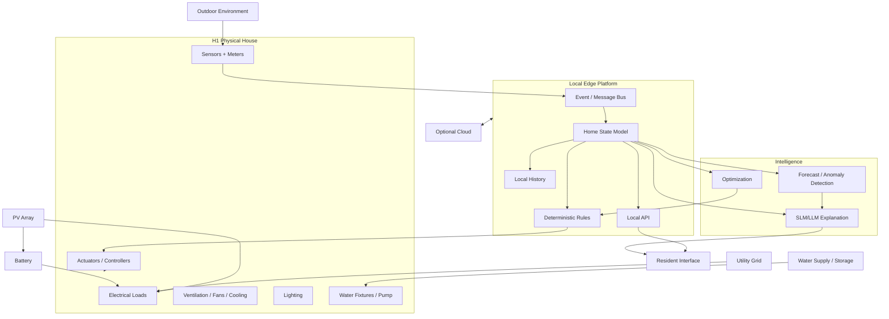

# 03 — Full H1 System Architecture

## 1. Model H1 as a cyber-physical system

H1 has six conceptual layers:

```text
L6 — Resident / Experience
L5 — Intelligence / Decision Support
L4 — Edge Platform / Data / Automation
L3 — Device & Control Network
L2 — Physical Building Systems
L1 — Building / Environment
```

The website should make these layers understandable without forcing the user to read an engineering textbook.

## 2. Layer 1 — Building and environment

External inputs:
- outdoor air temperature;
- humidity;
- solar irradiance;
- wind;
- rainfall;
- time;
- occupancy;
- grid availability.

The building responds through:
- mass;
- glazing;
- shading;
- insulation;
- openings;
- natural ventilation;
- fans;
- mechanical cooling.

## 3. Layer 2 — Physical systems

### Energy
- PV array;
- inverter;
- battery;
- grid connection;
- main distribution;
- critical-load branch;
- smart meter;
- future EV-ready branch.

### Water
- primary supply;
- potable storage;
- pump/pressure system;
- flow meter;
- level sensing;
- leak sensors;
- optional rainwater collection;
- non-potable branch.

### Indoor environment
- operable windows;
- shading;
- local exhaust;
- fans;
- efficient cooling;
- lighting.

### Safety/security
Represent only conceptually unless researched in detail:
- fire/smoke detection;
- access;
- intrusion sensing;
- cameras where privacy/need justify them.

Do not let the visualization imply that safety engineering has been completed.

## 4. Layer 3 — Devices and controls

Potential sensors:

### Energy
- whole-house smart meter;
- inverter telemetry;
- battery/BMS telemetry;
- branch monitoring later.

### Water
- tank level;
- flow;
- pressure;
- pump state;
- point leak sensors.

### Indoor
- temperature;
- relative humidity;
- CO2;
- PM2.5 where justified;
- illuminance;
- occupancy/presence.

### Outdoor
- temperature/humidity;
- rain;
- optional irradiance;
- optional local weather station.

## 5. Layer 4 — Local edge platform

The edge gateway is H1's local computing layer.

Prototype hardware can be Raspberry-Pi-class or a small PC. Production hardware is intentionally undecided.

Responsibilities:
- device adapters;
- telemetry ingestion;
- event/message bus;
- local rules;
- home-state computation;
- local data cache/history;
- WebSocket/REST API;
- offline operation;
- secure cloud sync when available.

Possible prototype stack:
- Linux;
- containers;
- MQTT;
- Python/TypeScript services;
- local time-series storage;
- Home Assistant as a research integration option;
- custom H1 state service.

The website can simulate this architecture before physical hardware exists.

## 6. Layer 5 — Intelligence

Separate four categories.

### Deterministic rules
Examples:
- outage transition;
- reserve protection;
- leak action;
- pump interlock;
- manual-override priority.

### Optimization
Examples:
- battery schedule;
- flexible load shifting;
- comfort/energy tradeoffs.

### Machine learning
Possible research:
- load forecasting;
- PV forecasting;
- anomaly detection;
- occupancy estimation;
- equipment fault detection.

### SLM/LLM
Good roles:
- natural-language explanation;
- Q&A over H1 documentation;
- event summarization;
- resident recommendations;
- explaining why a rule fired.

Bad default roles:
- bypassing battery protections;
- closing electrical contactors directly;
- overriding critical water safety;
- making unbounded autonomous infrastructure decisions.

## 7. Layer 6 — Resident experience

The user should see:
- current state;
- important alerts;
- explanations;
- useful controls;
- manual override;
- privacy settings.

The user should not have to monitor hundreds of raw graphs.

## 8. Cloud role

Cloud is optional for critical operation.

Possible cloud functions:
- long-term analytics;
- remote access;
- software/model updates;
- backup;
- aggregate research with consent.

If internet fails:
- essential local rules continue;
- local dashboard remains;
- data queues for later sync;
- cloud AI may degrade gracefully.

## 9. Architecture diagram



## 10. Traceability IDs

Use IDs across Blender, code, diagrams and the dossier:

- `ENE-PV-001`
- `ENE-BAT-001`
- `ENE-GRID-001`
- `WAT-TANK-001`
- `WAT-LEAK-001`
- `IAQ-CO2-001`
- `IOT-EDGE-001`
- `AI-EXPLAIN-001`
- `MAT-ROOF-001`

This gives H1 a serious documentation backbone.

## 11. Key boundary

Always distinguish:

- visual simulation;
- research calculation;
- control prototype;
- future physical implementation.

Do not collapse them into one vague "AI smart home" concept.
