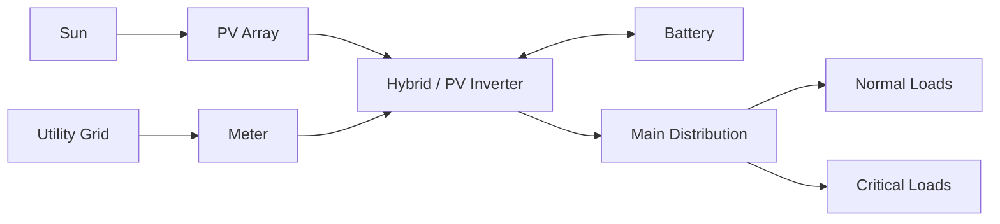
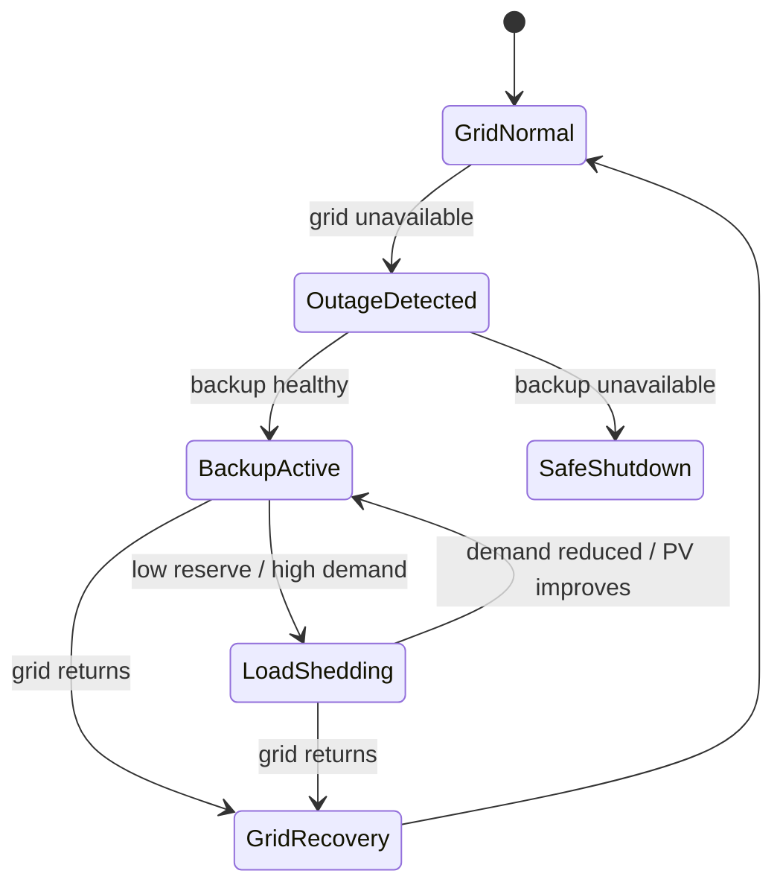
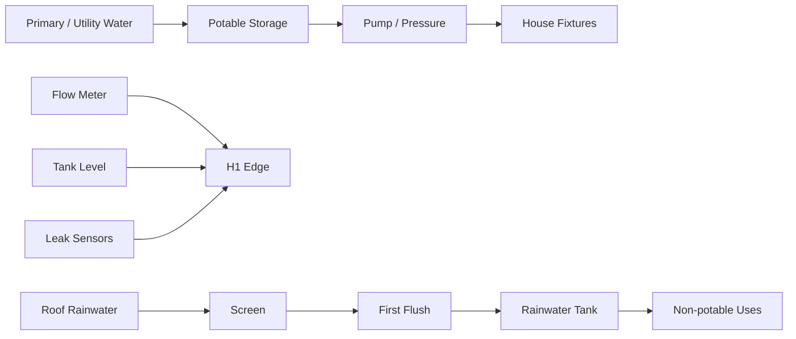

# 04 — Energy, Water, Climate and Resilience

# PART A — ENERGY

## 1. Objective

H1 should make residential energy understandable.

It should show:
- grid supply;
- solar generation;
- battery storage;
- house demand;
- critical loads;
- outage behavior;
- possible import/export;
- energy-management decisions.

Do not choose final PV or battery capacity because it looks impressive. Size from research.

## 2. Ghana context

Ghana's Energy Commission publishes a Net Metering Code for renewable customer-generators connected to distribution networks.

Therefore H1 should include a conceptual grid-connected PV mode.

A future physical system must still satisfy:
- current Energy Commission regulations;
- distribution-utility requirements;
- applicable inverter/battery/panel regulations;
- connection studies and approvals.

H1 must not imply that the concept is already approved.

## 3. Resilience principle

Grid-connected PV does not automatically mean a house remains powered during an outage.

H1 should teach that backup operation requires appropriate inverter/storage/control architecture.

Outage experience:

```text
GRID OFFLINE
      ↓
backup/islanding logic
      ↓
PV/battery available?
      ↓
critical-load branch
      ↓
optional load shedding
```

## 4. Conceptual topology



A real system also requires engineered:
- protection;
- earthing;
- isolation;
- anti-islanding;
- breaker/cable sizing;
- approved equipment;
- utility interface.

## 5. Load model before sizing

Create load categories.

### Essential
- refrigerator/freezer;
- networking;
- edge gateway;
- selected lights;
- safety/security;
- essential water controls/pump.

### Comfort
- fans;
- selected cooling;
- entertainment.

### Flexible
- laundry;
- optional dishwasher;
- EV charging later;
- water heating where applicable.

For each load record:
- rated power;
- standby;
- schedule;
- duration;
- flexibility;
- priority;
- outage behavior.

## 6. Sizing workflow

```text
house geometry
   +
reference household load
   +
Accra weather/solar
   ↓
PV candidates
   ↓
battery candidates
   ↓
hourly simulation
   ↓
energy + resilience comparison
```

Use PVGIS / NASA POWER as input sources. PVGIS and NREL PVWatts/SAM can be used for PV performance checks.

## 7. Battery state model

A simplified research model can use:

```text
SOC(t+Δt) =
SOC(t) +
[η_charge × P_charge
 - P_discharge / η_discharge] × Δt / E_usable
```

bounded by:
- min SOC;
- max SOC;
- charge/discharge power;
- inverter limit.

The browser model is illustrative, not a protective BMS.

## 8. Outage state machine



## 9. Energy scenarios

- Sunny / grid normal
- Cloudy / grid normal
- Night / grid normal
- Sunny / grid outage
- Night / grid outage
- Low battery / grid outage

Each scenario needs:
- input conditions;
- time series;
- expected system response;
- UI explanation.

## 10. Energy panel

Example:

```text
ENERGY
Solar        3.4 kW
House        2.1 kW
Battery      +1.1 kW charging
Grid         -0.2 kW export
SOC          68%
```

During outage:

```text
GRID
Offline

BACKUP
Active

BATTERY
68%

LOAD MODE
Critical
```

Only show an autonomy estimate if it is calculated from the scenario.

---

# PART B — WATER

## 11. Objective

Water is a first-class system.

Show:
- source;
- storage;
- pumping;
- flow;
- leaks;
- rain;
- potable/non-potable separation.

## 12. Conceptual water architecture



The exact potable supply design remains site-specific.

## 13. Rainwater safety

Do not imply that rainwater is automatically drinkable.

WHO/CDC guidance supports a risk-managed approach to rainwater collection and storage.

H1 V1 default:
`rainwater = non-potable research use`

Possible research uses:
- irrigation;
- exterior cleaning;
- toilet flushing only if compliant separation/treatment is designed later.

## 14. Rain scenario

When user selects `RAIN`:

1. cloud cover grows;
2. rain begins;
3. roof wetness changes;
4. gutters/runoff highlight;
5. rainwater path activates;
6. tank state updates;
7. PV output falls according to scenario data;
8. daylight/lighting may change.

This is valuable because one environmental event affects multiple H1 systems.

## 15. Leak detection

Model:
- point moisture sensor;
- whole-house flow anomaly.

Example:
if occupancy is zero but continuous flow persists beyond a researched threshold:
`Possible leak`

Do not let an LLM decide whether a critical shutoff should happen.

## 16. Water balance

```text
V(t+Δt) =
clip[
  V(t)
  + inflow
  + rain_collection
  - household_use
  - irrigation,
  0,
  capacity
]
```

Rain capture research:

```text
collection ≈ rainfall depth × effective roof area × collection efficiency
```

Efficiency must be documented.

---

# PART C — CLIMATE AND IAQ

## 17. Comfort principle

Thermal comfort is not one thermostat number.

Relevant factors include:
- air temperature;
- radiant temperature;
- humidity;
- air speed;
- clothing;
- activity;
- occupant preference.

ASHRAE Standard 55 is a useful research framework, including adaptive comfort.

## 18. Passive hierarchy

```text
shade
 ↓
reduce heat gain
 ↓
use useful outdoor airflow
 ↓
fans
 ↓
mechanical cooling/dehumidification
 ↓
optimization
```

## 19. Weather inputs

Retrieve:
- dry-bulb temperature;
- relative humidity;
- wind;
- solar irradiance;
- rainfall.

NASA POWER and PVGIS are initial sources.

Record:
- source;
- time standard;
- date range;
- spatial resolution;
- missing data.

## 20. Indoor zones

Initial:
- Living
- Kitchen
- Primary Bedroom
- Bedroom 2
- Study
- Technical

The interactive V1 only needs 2–3 detailed zones.

## 21. Sensors

Research baseline:
- temperature/RH;
- CO2 in representative occupied zones;
- optional PM2.5;
- illuminance;
- privacy-conscious occupancy/presence.

Avoid making cameras the default occupancy sensor.

## 22. Natural vs mechanical ventilation

Distinguish:
- operable-window ventilation;
- local exhaust;
- controlled ventilation;
- air recirculation.

Moving indoor air is not equivalent to supplying outdoor air.

ASHRAE 62.2 provides a useful residential IAQ/ventilation reference.

## 23. Humidity nuance

Warm/humid climates mean:
`open windows always` is not a sufficient strategy.

Consider:
- outdoor humidity;
- rain;
- outdoor air quality;
- noise;
- security;
- occupant choice.

## 24. Conceptual comfort controller

```text
IF unoccupied:
    setback / low-energy mode
ELSE IF comfortable:
    no action
ELSE IF outdoor conditions suitable:
    natural ventilation where allowed
ELSE IF air movement can restore comfort:
    efficient fan
ELSE:
    mechanical cooling/dehumidification within target
```

Thresholds are research outputs.

## 25. Climate interaction

Click `CLIMATE`:
- room zones reveal;
- airflow arrows appear;
- windows show state;
- panel shows simulation data.

Example:

```text
LIVING
Temperature       27.4°C
Relative humidity 61%
CO2               720 ppm
Occupancy         3
Mode              Natural ventilation + fan
```

## 26. One simulation clock

Day/night must affect:
- sun position;
- irradiance;
- PV;
- lighting;
- occupancy;
- outdoor temperature;
- battery/grid;
- cooling.

Never make the scene visually night while the energy model believes it is noon.

## 27. Research-grade thermal engine

Use EnergyPlus for serious building-physics comparison.

The browser should read precomputed outputs rather than pretending to calculate full thermal physics in Three.js.
