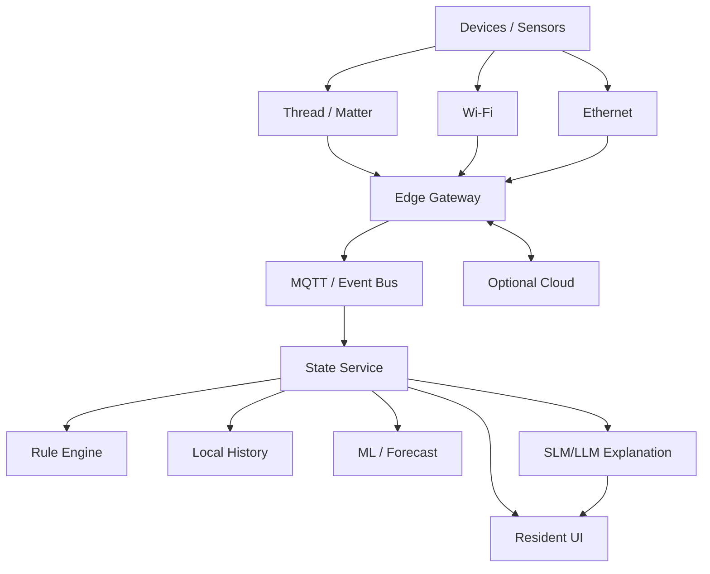

# 05 — IoT, Edge Computing, AI and Security

## 1. Principle

A Horizon home should not stop functioning because the internet fails or a cloud API changes.

Critical behavior should be local-first.

## 2. Connectivity classes

### Ethernet
Prefer for:
- edge gateway;
- stationary critical/high-bandwidth systems;
- cameras if used;
- technical equipment where cabling is sensible.

### Wi-Fi
Useful for:
- resident devices;
- high-bandwidth clients;
- selected appliances.

### Thread/Matter research path
Thread is an IP-based low-power mesh designed for connected-home/building devices. Matter can support interoperable application-layer behavior across compatible ecosystems.

Potential use:
- environmental sensors;
- lights;
- locks;
- low-power devices.

Do not make H1 dependent on one vendor ecosystem.

## 3. Edge architecture



## 4. Prototype edge stack

Possible:

```text
Linux edge device
    ↓
containers
    ↓
device adapters
    ↓
MQTT/event bus
    ↓
H1 state service
    ↓
rules
    ↓
local history
    ↓
WebSocket/REST
```

The V1 website can simulate this before physical devices exist.

## 5. Device data model

Each device should have:
- device ID;
- system;
- type;
- location;
- capabilities;
- firmware version;
- online state;
- security/update state;
- telemetry;
- approved commands.

## 6. Cybersecurity baseline

Use NIST IoT cybersecurity guidance as an initial design reference.

H1 should account for:
- unique identity;
- controlled configuration;
- data protection;
- access restriction;
- secure software updates;
- cybersecurity-state awareness.

## 7. Segmentation concept

Conceptual networks:
- resident;
- IoT;
- security/safety;
- edge services;
- guest;
- management.

Avoid giving every smart device direct access to sensitive data services.

## 8. Internet-outage scenario

Trigger:
`INTERNET OFF`

Expected:
- local lighting/control still works;
- edge gateway remains;
- leak alert works locally;
- battery protections are unaffected;
- local dashboard is available;
- cloud assistant becomes unavailable or switches to local model;
- queued data syncs later.

## 9. AI split

### Deterministic
Authority for infrastructure rules.

Example:
```text
IF grid == offline
AND battery_soc < reserve
THEN shed flexible loads
```

### Optimization
Can propose:
- charging schedule;
- flexible load timing;
- comfort/energy balance.

### ML
Candidate experiments:
- load forecasting;
- PV forecasting;
- anomaly detection;
- occupancy prediction;
- equipment fault detection.

### SLM/LLM
Reads:
- current structured H1 state;
- recent events;
- approved H1 documentation.

Produces:
- explanation;
- Q&A;
- summaries;
- noncritical recommendations.

## 10. Local SLM vs cloud LLM

### Local SLM
Pros:
- privacy;
- offline;
- low latency;
- predictable cost.

Constraints:
- memory/compute;
- smaller reasoning capacity.

### Cloud LLM
Pros:
- stronger language/reasoning;
- fast experimentation.

Constraints:
- connectivity;
- cost;
- privacy/data governance.

The interface should support either later.

## 11. Tool boundary

Do not let an LLM call arbitrary devices.

Concept:

```text
LLM
 ↓
intent / explanation
 ↓
policy gate
 ↓
approved tool
 ↓
deterministic controller
```

For V1, AI should preferably be advisory/read-only.

## 12. Privacy

H1 should research:
- minimum occupancy data needed;
- local retention;
- camera access;
- cloud consent;
- deletion;
- offline operation.

"Smart" should not mean surveillance-heavy.

## 13. Public AI demo

Good demo:

User:
`What happens if the grid goes out tonight?`

Assistant receives the simulation state and answers:

```text
The grid is offline.
The battery is at 68%.
H1 switched to critical-load mode.
Solar is unavailable until morning.
```

If autonomy is shown, it must be calculated.

Label:
`Simulation explanation`

This is far more credible than a generic chatbot embedded in the house.
