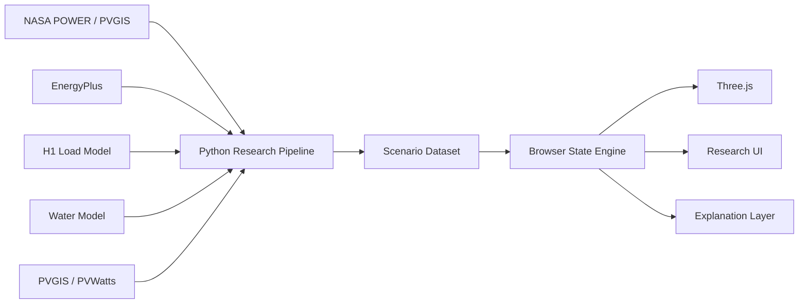

# 07 — Simulation, Research Dossier and Validation

## 1. Core architecture decision

Do not use Three.js as the research simulator.

Use two tiers.

### Tier A — Research computation
- Python;
- EnergyPlus;
- PVGIS/PV tools;
- documented equations;
- source datasets.

### Tier B — Browser experience
- reads scenario data;
- interpolates state;
- renders Three.js;
- shows research panels;
- gives explanations.

This allows the site to remain fast and visually rich without faking engineering.

---

# 2. Research-to-web pipeline



---

# 3. Single simulation clock

State:

```text
date
time
timezone
scenario
speed
paused
```

Every subsystem reads the same time.

---

# 4. Browser state schema

Conceptually:

```ts
type H1State = {
  time: {
    iso: string
    hour: number
  }

  weather: {
    condition: "sunny" | "cloudy" | "rain"
    outdoorTempC: number
    relativeHumidityPct: number
    irradianceWm2: number
    rainMmHr: number
    windMs: number
  }

  grid: {
    available: boolean
    importKw: number
    exportKw: number
  }

  energy: {
    pvKw: number
    loadKw: number
    batterySocPct: number
    batteryPowerKw: number
    criticalMode: boolean
  }

  water: {
    potableTankPct: number
    rainTankPct: number
    flowLpm: number
    leakState: "normal" | "suspected" | "confirmed"
  }

  indoor: Record<string, {
    tempC: number
    rhPct: number
    co2Ppm?: number
    occupied: boolean
  }>

  edge: {
    online: boolean
    internet: boolean
    localAutomation: boolean
  }
}
```

---

# 5. Initial scenarios

- `S01 sunny_normal`
- `S02 cloudy_normal`
- `S03 rain_normal`
- `S04 night_normal`
- `S05 sunny_grid_outage`
- `S06 night_grid_outage`
- `S07 low_battery_outage`
- `S08 water_leak`
- `S09 internet_outage`
- `S10 high_indoor_humidity`

Each scenario records:
- input conditions;
- initial state;
- time series;
- expected behavior;
- explanation.

---

# 6. Reproducibility metadata

Each generated scenario should record:

```text
scenario_version
weather_source
weather_period
model_version
assumptions_version
code_commit
generation_timestamp
```

This matters for an academic/portfolio project.

---

# 7. Thermal simulation

Use EnergyPlus for serious zone temperature/cooling analysis.

Export selected:
- zone temperature;
- RH if modeled;
- cooling load;
- fan/HVAC state;
- comfort metrics;
- solar gains.

For V1, representative days are enough.

---

# 8. Energy simulation

Research pipeline:
- PV production;
- household load;
- battery model;
- grid state.

Use 5-, 15- or 60-minute intervals depending the experiment.

Browser interpolates.

---

# 9. Water simulation

Use explicit mass balance:
- demand schedule;
- storage;
- inflow;
- rainfall;
- collection;
- pump;
- leak event.

---

# 10. Occupancy

Create a synthetic named profile:
`H1 Reference Household A`

Document:
- number of occupants;
- weekday/weekend schedule;
- room usage assumptions.

Do not imply it represents all households in Ghana.

---

# 11. Rule records

Keep rules human-readable.

```text
rule: ENE_OUTAGE_01
when:
  grid.available == false
then:
  energy.criticalMode = true
reason:
  Preserve essential services during a grid outage.
```

---

# 12. AI context

The LLM receives structured state, not pixels.

Example:

```json
{
  "scenario": "night_grid_outage",
  "grid": "offline",
  "pvKw": 0,
  "batterySocPct": 68,
  "loadKw": 0.9,
  "criticalMode": true,
  "events": [
    "grid lost at 20:14",
    "critical mode activated"
  ]
}
```

Then retrieve relevant H1 documentation and explain.

---

# 13. Data labels

Every numeric value exposed publicly should be classified:

- **Demo** — synthetic placeholder.
- **Simulation** — model output.
- **Measured** — physical sensor.
- **Forecast** — model prediction.

Never mix them silently.

---

# 14. Technical design dossier

Do not start by forcing this into an academic paper.

Build a technical dossier first.

Suggested structure:

1. Executive summary
2. Vision and research questions
3. Ghana/Accra reference context
4. Building architecture
5. Materials decisions
6. Energy
7. Water
8. Climate/IAQ
9. IoT/edge
10. AI
11. Interactive model
12. Simulation methodology
13. Results
14. Limitations
15. Future work
16. References
17. Appendices

---

# 15. Decision log

Every major decision gets an ID.

Example:

```text
DECISION: ENE-BAT-002

Question:
What battery reserve should H1 hold?

Current answer:
TBD.

Why unresolved:
Load profile and outage target incomplete.

Required evidence:
- load profile
- outage objective
- battery constraints
- cost
- inverter/BMS behavior

Next action:
parameter sweep
```

A documented "TBD" is better than an invented number.

---

# 16. Source hierarchy

Prefer:

### Tier A
- Ghana Standards Authority;
- Ghana Energy Commission;
- WHO;
- NIST;
- DOE/NREL;
- NASA;
- European Commission JRC;
- ASHRAE;
- peer-reviewed studies.

### Tier B
- IFC/World Bank;
- engineering societies;
- university publications;
- manufacturer technical/EPD data.

### Tier C
- respected professional industry sources.

Do not justify technical choices mainly from marketing blogs.

---

# 17. Validation invariants

### Energy
- SOC remains 0–100%;
- grid offline implies zero import/export;
- battery power stays within model limits;
- energy balance closes within tolerance.

### Water
- tanks stay within 0–capacity;
- potable/non-potable remain separate.

### Time
- night implies solar output near zero;
- UI time equals model time.

### Outage
- critical-mode behavior matches rules.

---

# 18. Scenario acceptance

### Sunny
PV state changes coherently.

### Rain
Rain visual + water path + PV change.

### Night
Sky/lights/PV/energy all change.

### Grid outage
Grid disconnect + backup + critical load behavior.

### Leak
Abnormal flow + highlighted location + alert.

### Internet outage
Local systems remain while cloud degrades.

---

# 19. UX acceptance questions

A visitor should be able to answer within roughly two interactions:

- Where does power come from?
- What happens in an outage?
- Where is water stored?
- What happens when it rains?
- What does AI do?
- Why this roof?
- Is this house real?

---

# 20. H1 release sequence

```text
H1 0.1 — current visual shell
H1 0.2 — semantic Blender/GLB
H1 0.3 — interactive Three.js shell
H1 0.4 — energy + outage
H1 0.5 — water
H1 0.6 — climate
H1 0.7 — edge/AI explanation
H1 1.0 — integrated research demonstrator
```

These are version labels, not promised dates.

---

# 21. H1 1.0 definition

H1 1.0 requires:
- interactive model;
- energy scenario;
- water scenario;
- climate view;
- systems view;
- research drawer;
- citations;
- versioned assumptions;
- reproducible scenario data;
- responsive fallback;
- no known contradictory state;
- clear concept/simulation labels.
